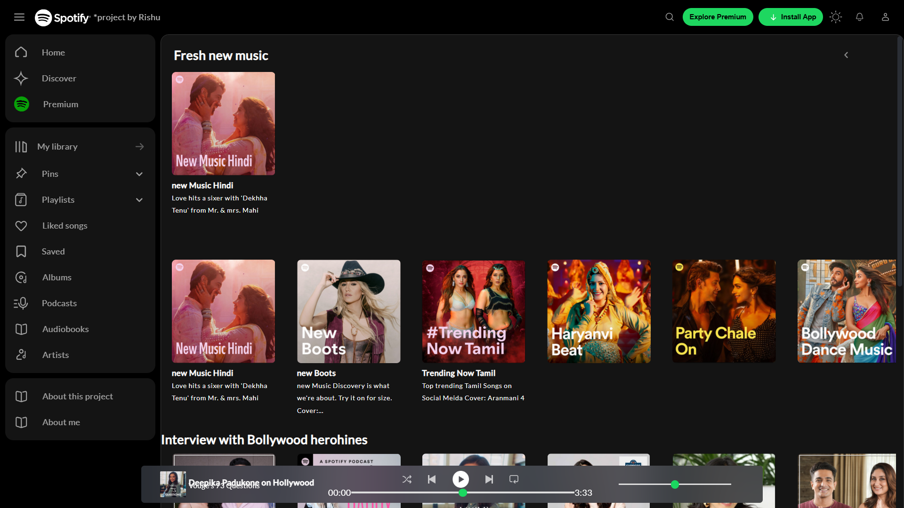

# Spotify Clone

A year ago (June 2024), I built a cool Spotify frontend clone. It was just there in my files, so thought of sharing it to Github. it's just html, css and js. no frameworks used. made it completely responsive, with dark/light theme and fresh new redesigned UI.

---

## 🚀 Live Site

# 👉 [Check it out here](https://rishukumarcodes.github.io/Spotify-Frontend/)

---

## ✨ Highlights

- Fully **responsive** on all screen sizes
- Clean **UI redesign**
- **Light and Dark mode** toggle

---

## 📸 Screenshots

---

Built Html, Css and JavaScript.

---

> Crafted with patience and passion by Rishu
